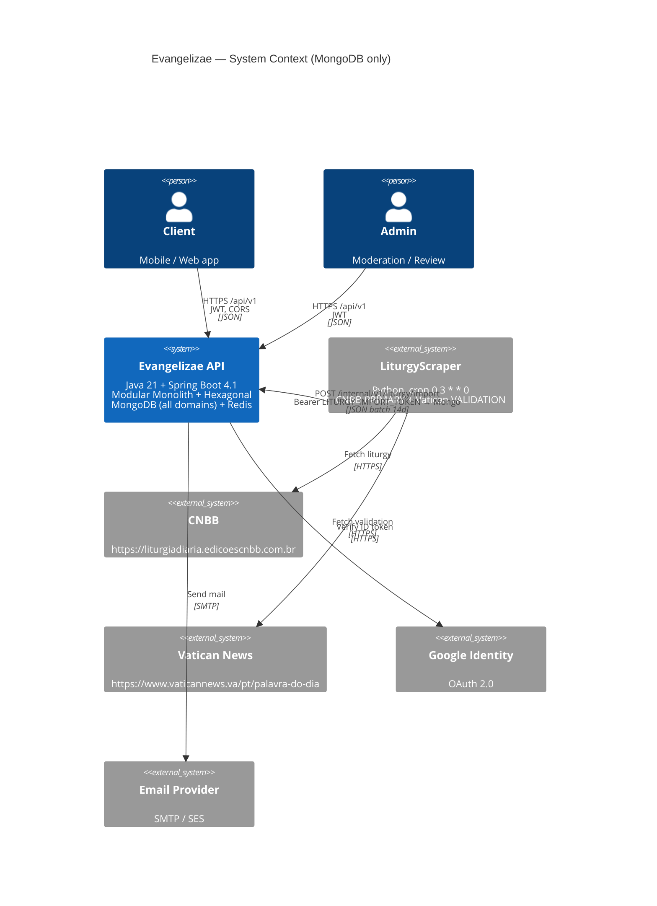
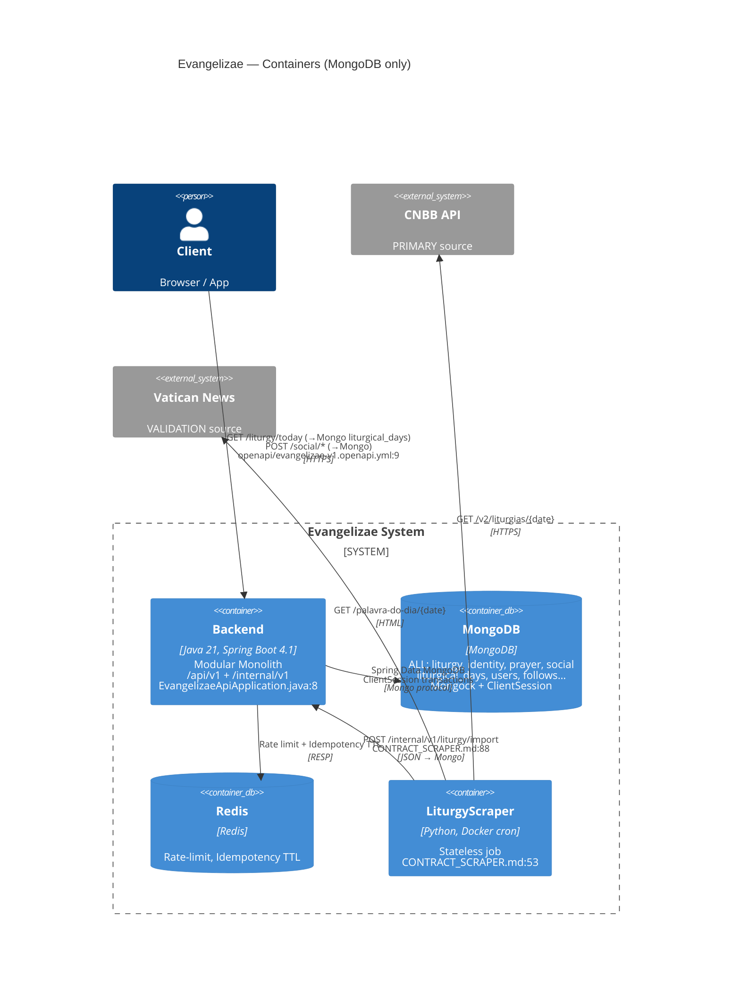
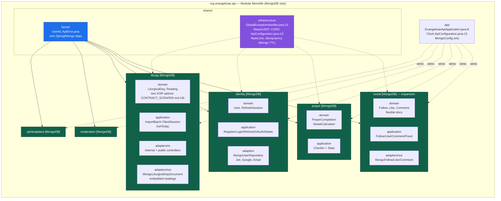
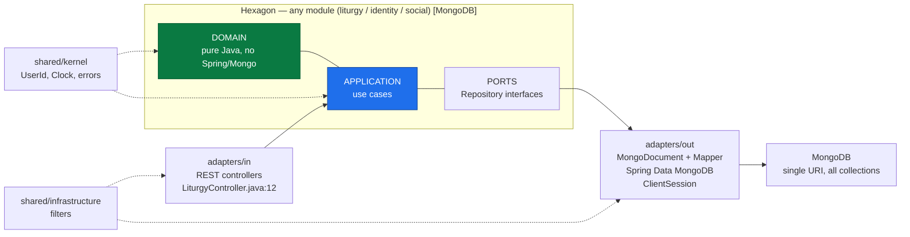
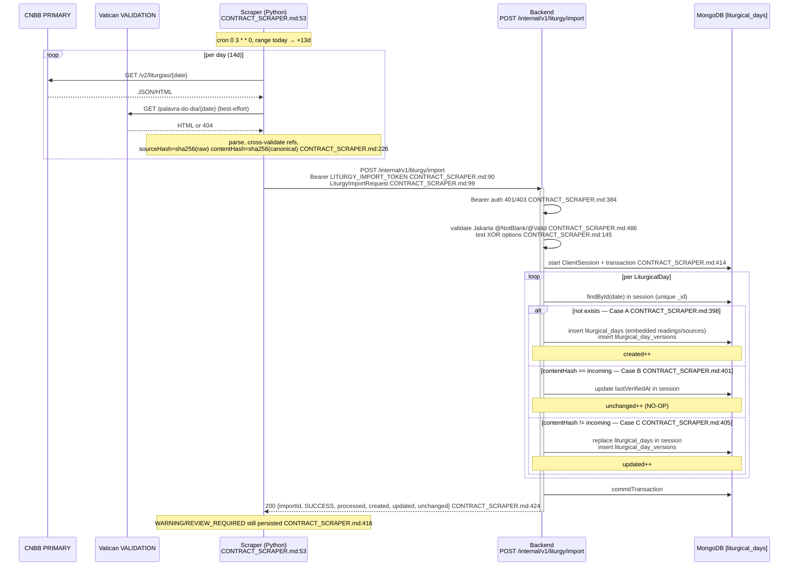
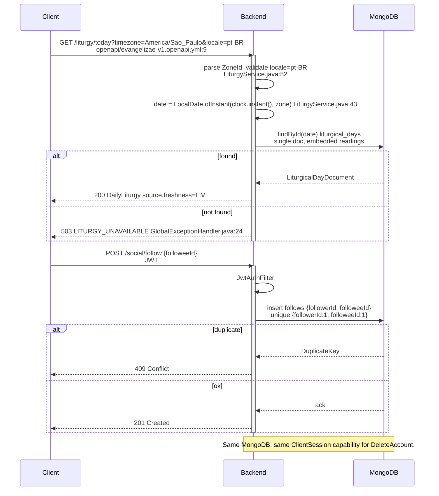
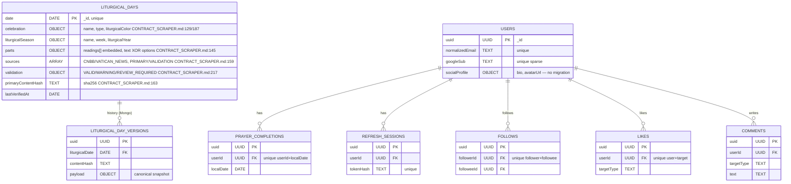
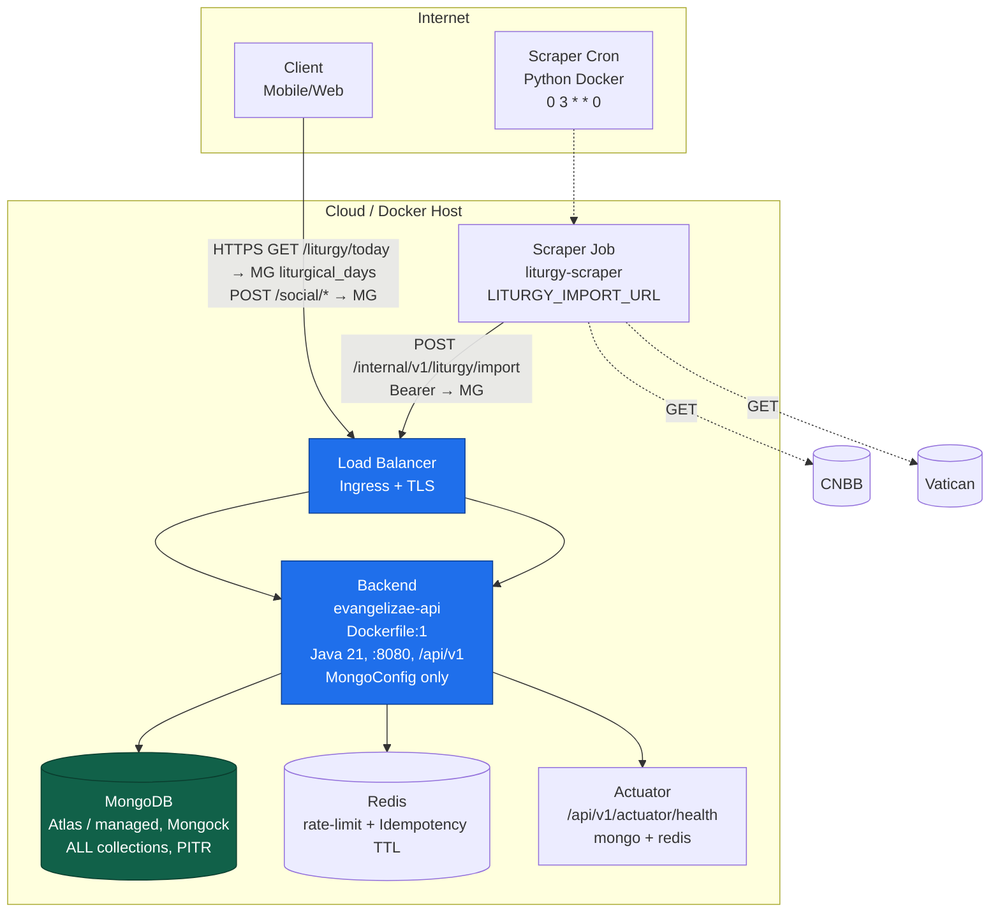
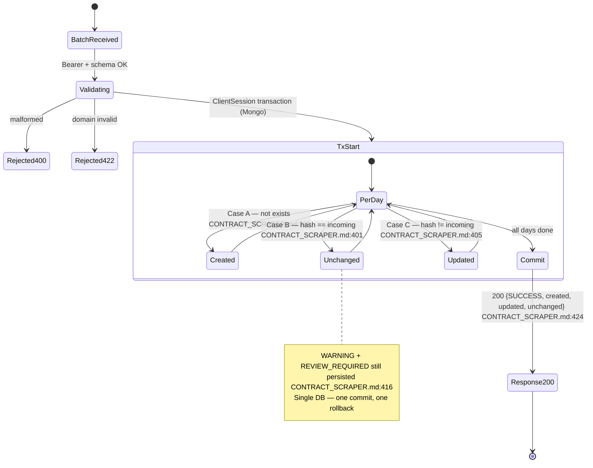

# Evangelizae — Visual Architecture

> Render with any Mermaid viewer (GitHub, VS Code, mermaid.live). Pairs with `ARCHITECTURE.md` (spine) and `SYSTEM_DESIGN.md` (decisions).
> **MongoDB only** + Redis. Liturgy contract `CONTRACT_SCRAPER.md:38` PostgreSQL → Mongo migration noted in `ARCHITECTURE.md:1`.

---

## 1. System Context (C4 L1)

---

## 2. Containers (C4 L2)

Single `SPRING_DATA_MONGODB_URI` — no `PostgreSQL`.

---

## 3. Backend Modules (Package-by-Feature — All MongoDB)

**Dependency rule:** `adapters → application → domain ← ports`, `shared/kernel` only shared. All adapters are `MongoDocument + Mapper`.

---

## 4. Hexagonal Slice (single paradigm)

No `JPA`. One `@Document` per collection, same pattern everywhere — simplifies onboarding.

---

## 5. Ingestion Sequence (Scraper → Backend → MongoDB)

Single `ClientSession` — no cross-DB commit.

---

## 6. Public Reads (MongoDB only)

---

## 7. Data Model (ER — MongoDB Only)

`PostgreSQL JOINs` → `Mongo` embedded `readings/sources` — single `findById` for `GET /liturgy/today`.

---

## 8. Deployment (MongoDB only)

**Env:** `PORT=8080` `src/main/resources/application.yml:8`, `APP_CORS_ALLOWED_ORIGINS` `.env.example:1`, `LITURGY_IMPORT_TOKEN` `CONTRACT_SCRAPER.md:610`, `SPRING_DATA_MONGODB_URI` only, `REDIS_URL`, `JWT_SECRET`, `GOOGLE_CLIENT_ID`. No `SPRING_DATASOURCE_URL`.

---

## 9. Failure & Idempotency (Mongo ClientSession)

---

## 10. How to Use This File

- `mermaid.live` → paste any block → export SVG/PNG for docs/slides.
- GitHub renders Mermaid natively in this markdown.
- Keep `ARCHITECTURE.md` as the rulebook, `SYSTEM_DESIGN.md` as the reasoning, this file as the **visual atlas**.

